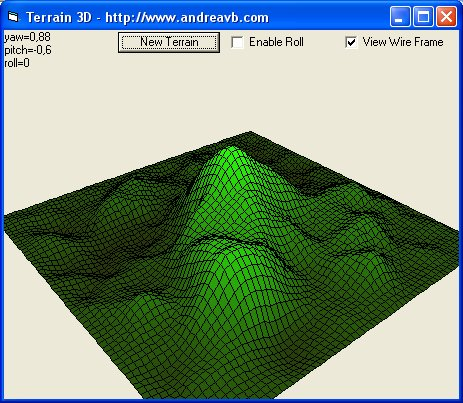



## Terrain 3D

### Description

AndreaVB releases a new Visual Basic example. Render a 3D random terrain with gradient colors and water level, rotate and move the viewing position by moving the mouse with left or right button. The example shows how to convert 3D space coordinates to 2D screen coordinates
 
### More Info
 

             |
---                |---
**Submitted On**   |2006-03-07 08:55:14
**By**             |[AndreaVB](https://github.com/Planet-Source-Code/PSCIndex/blob/master/ByAuthor/andreavb.md)
**Level**          |Intermediate
**User Rating**    |5.0 (50 globes from 10 users)
**Compatibility**  |VB 6\.0
**Category**       |[Graphics](https://github.com/Planet-Source-Code/PSCIndex/blob/master/ByCategory/graphics__1-46.md)
**World**          |[Visual Basic](https://github.com/Planet-Source-Code/PSCIndex/blob/master/ByWorld/visual-basic.md)
**Archive File**   |[Terrain\_3D1979093102006\.zip](https://github.com/Planet-Source-Code/andreavb-terrain-3d__1-64599/archive/master.zip)

